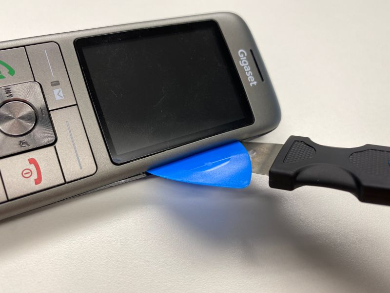

# Gigaset CL660HX

The CL660HX is an universal handset for addition to DECT/GAP routers or base
stations.

## Teardown

The handset is not designed for easy opening. There are a lot of very tight clips in
the case that hold the top shell in place.

I used the iFixit _Jimmy_ tool to open the case next to the display a small
gap. After that, I used several plectrums to open the case completely.

:warning: Warning: If you open the case, the small speaker will fall out and
could be lost. Likewise, when you reassemble it, you have to put it back in
the right way around.

## Disable the red flashing light

The device has an extremely annoying red flashing light that cannot be turned
off via software. When soft methods don't work, you unfortunately have to
resort to harder measures ;-)

I solved it by attaching a RLDD (red light disabling device, some ignorant
people also call it a piece of scotch tape) to the back of the keyboard, as
shown here in the pictures:

## Credits

Visual effects for the red light photo were contributed by _Frank_. Thanks.

